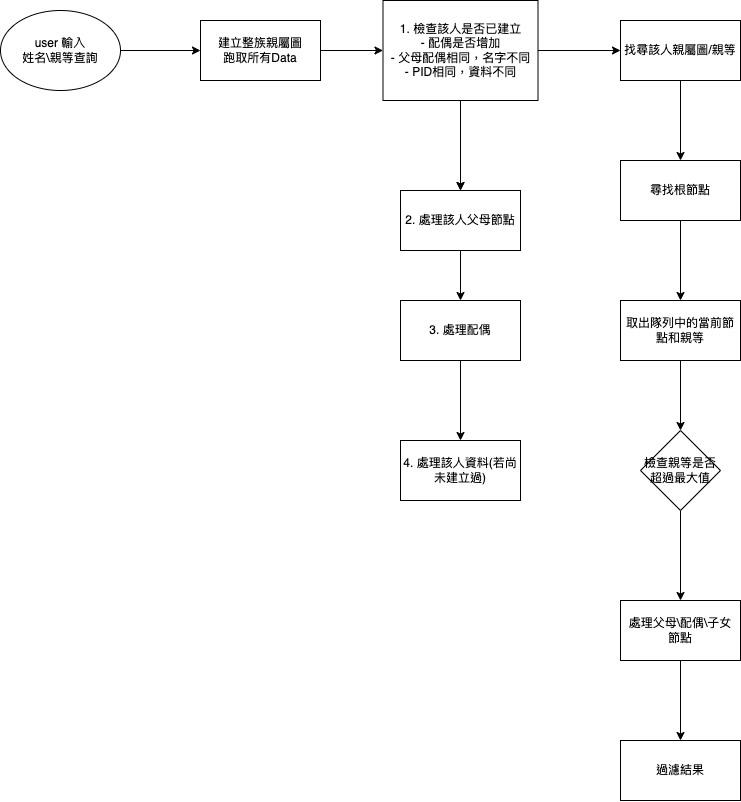

## Background
透過甲仙地區資料，透過Go.js套件視覺化該族親屬圖譜。
資料中有種族一欄，填寫居民的祖籍，常見者有福、廣、熟、生、內、中六種，福為台灣居民而來自福建省者，廣為來自廣東者，熟為熟番，即平埔族民，生為生番，即泰雅等九族，內為來自日本本島者，中則在日本治台時期由中國移入者。

## Usage
//  node server.js  
即可在 http://localhost:3000/genogram.html 透過輸入姓名以及親等，找出該人幾親等的親屬圖

## Flow

